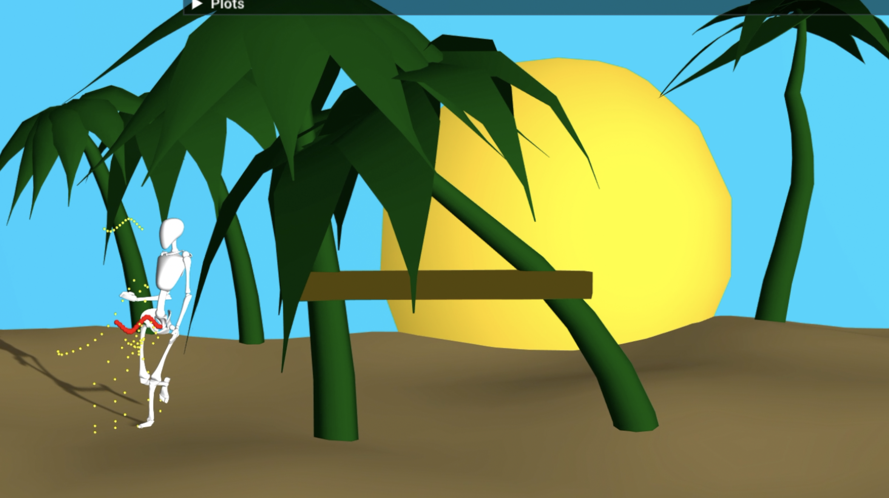
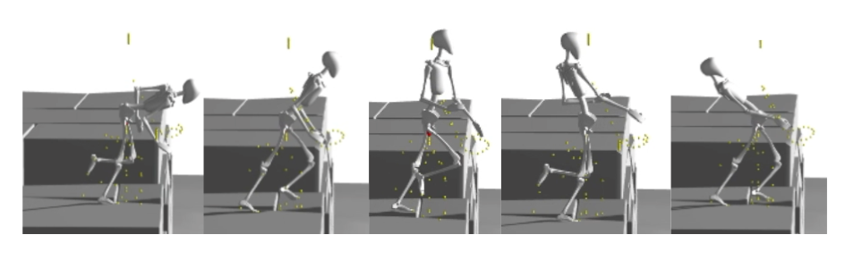
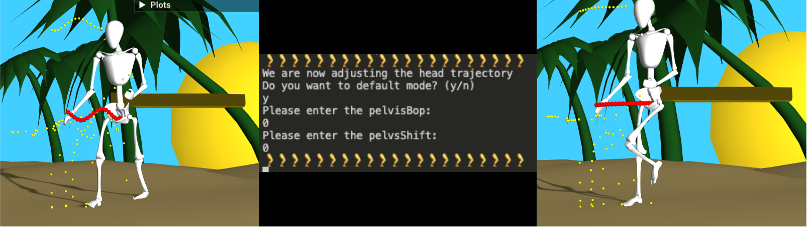

# IK-editor

This is our branch designed for live modeling of joint angles and trajectories. It also by default loads our territory shown in the demo. 

## Joint IDs used in the editor
|ID | Joint | Parent joint | Axis | Default angle| Angle constraints May 27th | Suggested change |
| :---   |     :---:        |     :---:      |:---:      |:---:      |     :---:      |          ---: |
|1 |lowerback_x   | pelvis| x     | n.a | (-0.5,0.5)    ||
|2 |lowerback_y    | lumbar_tmp1 | y  | n.a.   | (-0.5,0.5)      ||
|3|lowerback_z    | lumbar_tmp2| z | n.a.      | (-0.5,0.5)      ||
|4|upperback_x    | lumbar| x | n.a.      | (-0.5,0.5)      ||
|5|upperback_y    | torso_tmp1| y | n.a.      | (-0.5,0.5)      ||
|6|upperback_z    | torso_tmp2| z  | n.a.     | (-0.5,0.5)      ||
|7|lowerneck_x    | torso| x | n.a.      | (-0.5,0.5)      ||
|8|lowerneck_y    | neck_tmp1| y | n.a.     | (-0.5,0.5)      ||
|9|lowerneck_z    | neck_tmp2| z  | n.a.    | (-0.5,0.5)      ||
|10|upperneck_x    | neck| x  | n.a.    | (-0.5,0.5)      ||
|11|upperneck_y    | head_tmp1| y | n.a.   | (-0.5,0.5)      ||
|12|upperneck_z    | head_tmp2| z  | n.a.  | (-0.5,0.5)      ||
|13|lScapula_y   | torso| y  |  n.a. | (-0.8,0.2)      ||
|14|lScapula_z    | lScapula_tmp| z  | n.a.  | (-0.2,0.6)      ||
|15|lShoulder_1    | lScapula|  x   | n.a. | (-3.0,0.5)      ||
|16|lShoulder_2    | lUpperArm_tmp1| z | 0.13  | (-0.1,0.1)      ||
|17|lShoulder_torsion   | lUpperArm_tmp2| y | -0.5  | (-0.75,1)      ||
|18|lElbow_flexion_extension  | lUpperArm| x | -0.25  | (-2.5,0)      ||
|19|lElbow_torsion  | lLowerArm| y | n.a.  | (-1.0,1.6)     ||
|20|lWrist_x | lLowerArm_tmp| x | n.a.  | (-0.5,0.5)     ||
|21|lWrist_z  | lHand_tmp| z | -0.2  | (-1.0,1.0)     ||
|22|Scapula_y   | torso| y  |  n.a. | (-0.2,0.8)      ||
|23|rScapula_z    | rScapula_tmp| z  | n.a.  | (-0.6,0.2)      ||
|24|rShoulder_1    | rScapula|  x   | n.a. | (-3.0,0.5)      ||
|25|rShoulder_2    | rUpperArm_tmp1| z | 0.13  | (-0.1,0.1)      ||
|26|rShoulder_torsion   | rUpperArm_tmp2| y | 0.5  | (-0.5,0.75)      ||
|27|rElbow_flexion_extension  | rUpperArm| x | -0.25  | (-2.5,0)      ||
|28|rElbow_torsion  | rLowerArm| y | n.a.  | (-1.0,1.6)     ||
|29|Wrist_x | rLowerArm_tmp| x | n.a.  | (-0.5,0.5)     ||
|30|rWrist_z  | rHand_tmp| z | 0.2  | (-1.0,1.0)     ||
|31|lHip_1  | pelvis| x | n.a.  | (-1.2,1.2)     ||
|32|lHip_2  | lUpperLeg_tmp1| z | -0.0  | (-0.1,0.1)     ||
|33|lHip_torsion  | lUpperLeg_tmp2| y | 0.0  | (-0.75,0.75)     ||
|34|lKnee | lUpperLeg| y | 0.0  | (0,2.0)     ||
|35|lAnkle_1  | lLowerLeg| x | 0.0  | (-0.5,0.9)     ||
|36|lAnkle_2  | lFoot_tmp| z | 0.0  | (-0.5,0.5)     ||
|37|lToeJoint  | lFoot| x | 0.0  | (-0.75,0.2)     ||
|38|rHip_1  | pelvis| x | n.a.  | (-1.2,1.2)     ||
|39|rHip_2  | rUpperLeg_tmp1| z | 0.0  | (-0.1,0.1)     ||
|40|rHip_torsion  | rUpperLeg_tmp2| y | -0.0  | (-0.75,0.75)     ||
|41|rKnee | rUpperLeg| y | 0.0  | (0,2.0)     ||
|42|rAnkle_1  | rLowerLeg| x | 0.0  | (-0.5,0.9)     ||
|43|rAnkle_2  | rFoot_tmp| z | 0.0  | (-0.5,0.5)     ||
|44|rToeJoint  | rFoot| x | 0.0  | (-0.75,0.2)     ||

## Manual: Live editing of the joint constraints and trajectories
To edit the joint constraints live while the simulation is running, use the following commands:
| Key  | Functionality |
| :---         |      ---: |
| 0-9 | Press the number keys to enter the joint id (appends digit)|
| # | Reset current joint_id to empty string |
| Shift | Press to switch between editing min, max and both angles |
| + | Increment angle by 0.1 |
| - | Decrement angle by 0.1 |
| e | Print angle constraints of all joints and reset current joint to ""|
| i | Print info of current settings|
| x | Set min equals max|
| p | Edit pelvis trajectory (follow instructions in terminal) |
| l | Edit leg trajectory (follow instructions in terminal). When prompted for input you have to enter four numbers into the terminal each followed by an enter. Those resemble the vales for: lLowerLeg, rLowerLeg, lToes, rToes |
| h | Edit hand trajectory (follow instructions in terminal). When prompted for input you have to enter two numbers into the terminal each followed by an enter. Those resemble the vales for: lHand, rHand|
| k | Edit head trajectory (follow instructions in terminal)|

## References
.obj files for territory creations (e.g. palm trees) taken from: https://www.turbosquid.com/

