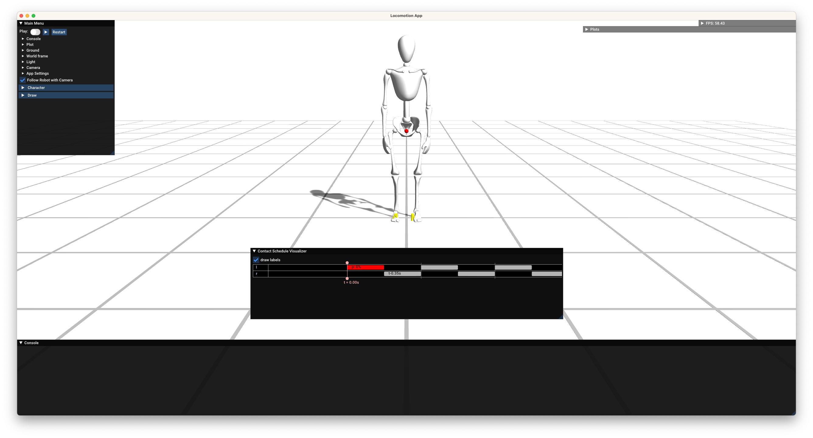

# procedural-locomotion

Code base for the project: Procedural Locomotion Engine For Digital Humans.

## Getting started

We recommend [JetBrains CLion](https://www.jetbrains.com/clion/) for the development.
It is a paid software, but JetBrains has the [student plan](https://www.jetbrains.com/community/education/#students)
that provides free licenses. See [this](https://www.jetbrains.com/help/clion/clion-quick-start-guide.html) for a quick
start guide.

1. Fork this repository and download the code.

2. Build the project (or build `locoApp`). You can build the project in cmake Release mode for realtime performance:
   see [this](https://www.jetbrains.com/help/clion/cmake-profile.html) for a guide about cmake profile for CLion.

3. Run the `locoApp`.

4. Select a model to play with: `Main Menu > Character > Model`. We have `Bob` and `Dog` for examples.



5. Press the space bar to play the app. You can give joystick command with arrow keys in your keyboard. If it does not
   move, don't freak out. It's normal. You have to implement a base (body) trajectory planning strategy as well as a
   inverse kinematics solver: recall [a1](https://github.com/Digital-Humans-23/a1). Once you've done that, you will see
   something like this.


6. Of course, we don't want this crappy walking motion. Now, try your best to generate more natural motions for our poor
   Bob! But first, play around the code, and try understanding it. Don't hesitate to contact Dongho (kangd@ethz.ch) if
   you have any question regarding the implementation.

## Immediate Next steps

- Implement an inverse kinematics solver: ```src/libs/loco/include/loco/kinematics/IK_Solver.h```. Complete TODO part.
- Complete a base (body) trajectory planning
  strategy: ```src/libs/loco/include/loco/planner/LocomotionPlannerHelpers.h```
- Design a strategy for arm motions. Modify ```src/libs/loco/include/loco/planner``` files to implement your strategy.
- Review biomechanics, computer graphics and robotics literature for a natural ankle motion. This is the most
  crucial step for successful demo!

## Comments

- Most likely, you wouldn't need to modify the following source code files in
    - ```src/libs/gui``` and ```src/libs/utils```: basic feature implementation for rendering, mathematical operation
      etc.
    - ```src/libs/loco/include/loco/robot``` and corresponding cpp files.
    - But of course, if you need, feel free to do it.
- This repo will be keep updated, so please stay tuned. If you want to sync your repo with the new commits,
  use ```git rebase``` instead of ```git merge```:
  see [this](https://www.atlassian.com/git/tutorials/merging-vs-rebasing) for more details of ```git rebase```.
- Please actively use GitHub issue for questions and reporting issues on the code base!

## Animating a new rigid body

### 1. Check if the rigid body has an end effector
Open `data/robots/bob/bob.rs` and look for the corresponding rigid body definition, e.g. `lUpperArm`:
```
RB
	name lUpperArm
	mesh robots/bob/meshes/lUpperArm.obj
	meshTransformation 1 0 0 0 	-0.16875 -0.39375 0
	mass	2.4027099609375					
	moi	0.02423240929842	0.00285087168216705	0.02423240929842	0	0	0	

	collisionSphere 0 0.16875 0 0.04	
	collisionSphere 0 -0.16875 0 0.04
/End_RB
```
Add an end effector as the desired position relative to the rigid body's origin (usually that's where one of the `collisionSphere`s is located):
```
RB
	name lUpperArm
	mesh robots/bob/meshes/lUpperArm.obj
	meshTransformation 1 0 0 0 	-0.16875 -0.39375 0
	mass	2.4027099609375					
	moi	0.02423240929842	0.00285087168216705	0.02423240929842	0	0	0	

	collisionSphere 0 0.16875 0 0.04	
	collisionSphere 0 -0.16875 0 0.04
  endEffector 0 0.16875 0 0.04
/End_RB
```
Check that the positioning is correct by running `locoApp` > Draw > Endeffectors. End effector appears as green sphere.

### 2. Register the end effector in `menu.h`
Open `src/apps/locoApp/menu.h` and add the rigid body name:
```c
// ...
CRL_DATA_FOLDER "/robots/bob/bob.rbs",  //
{
    {"lLowerLeg", "lLowerLeg"},
    {"rLowerLeg", "rLowerLeg"},
    {"lFoot", "lFoot"},
    {"rFoot", "rFoot"},
    {"lHand", "lHand"},
    {"rHand", "rHand"},
    {"head", "head"},
    {"pelvis", "pelvis"},
    {"<actual_RB_name>", "<your_RB_name>"}
},
0.9,   //
// ...
```

### 3. Add a new swing phase in `GaitPlanner.h`
A swing phase is a phase where the foot is not in contact with the ground and is an interval of length at most 1. However, for most body parts it does not make sense to define a swing phase, since they never touch the ground. If this is the case, make sure that the swing phase has length *nearly* 1, e.g. 0 to 0.999, or -0.5 to 0.499 (if you make it exactly 1, things break):
```c
PeriodicGait getPeriodicGait(const std::shared_ptr<LeggedRobot> &robot) const {
        PeriodicGait pg;
        double tOffset = -0.1;
        double heelOffset = 0.2;
        pg.addSwingPhaseForLimb(robot->getLimbByName("lLowerLeg"), 0 - tOffset, 0.5 + tOffset);
        // ...
        pg.addSwingPhaseForLimb(robot->getLimbByName("pelvis"), 0.0, 0.999);

        // Adding new swing phase
        pg.addSwingPhaseForLimb(robot->getLimbByName("<your_RB_name>"), 0.0, 0.999);
        pg.strideDuration = 0.7;
        return pg;
    }
  ```
### 4. (Only if the RB has to touch the ground)
  If your new RB should behave like a foot (i.e., it should make firm contact with the ground), you need to tell create a FootStepPlan. This will be done if you label it as a foot in `SimpleLocomotionTrajectoryPlanner.h`:
  ```c
  // ...  
bool isFoot = limb->name == "lLowerLeg" || 
  limb->name == "rLowerLeg" || 
  limb->name == "lFoot" || 
  limb->name == "rFoot" // add "<your_RB_name>" if required
  // ...
  ```
### 5. Create your cool trajectory!
In `LocomotionPlannerHelpers.h` you can now define a trajectory for your new rigid body. In particular, the constructor of the `LimbMotionProperty` class now takes the a limb object corresponding to the RB and then makes a case distinction based on the name of the limb. We are now using *3D* trajectories and Catmull-Clark interpolation (spline), so it should be enough to provide a few keyframes in the interval [0, 1]. An example for the hands is given below:
```c
// ...
} else if (is_hand) {
    generalSwingTraj.addKnot(0, V3D(0, 0.1, 0.0));
    generalSwingTraj.addKnot(0.25, V3D(0, 0, -0.2));
    generalSwingTraj.addKnot(0.75, V3D(0, 0.2, 0.2));
    generalSwingTraj.addKnot(1.0, V3D(0, 0.1, 0.0));
} else if (is_head) { 
// ...
```
The z-axis (last coordinate of the vectors defines forward), so in this case, we achieve a swinging motion back and forth and up and down. But don't we need to differentiate between left and right hand here? No, because in `GaitPlanner.h`, their respective swing-phases are offset by exactly 0.5, i.e., half a gait cycle:
```c
// ...
pg.addSwingPhaseForLimb(robot->getLimbByName("lHand"), 0, 0.999);
pg.addSwingPhaseForLimb(robot->getLimbByName("rHand"), -0.5, 0.499);
//...
```
That's it!
## Fine-tuning angle constraints
This table provides and overview of angle constrants chosen, as well as suggested changes due to fine-tuning the values: 
| Joint | Parent joint | Axis | Default angle| Angle constraints May 27th | Suggested change |
| :---         |     :---:      |:---:      |:---:      |     :---:      |          ---: |
|lowerback_x   | pelvis| x     | n.a | (-0.5,0.5)    ||
|lowerback_y    | lumbar_tmp1 | y  | n.a.   | (-0.5,0.5)      ||
|lowerback_z    | lumbar_tmp2| z | n.a.      | (-0.5,0.5)      ||
|upperback_x    | lumbar| x | n.a.      | (-0.5,0.5)      ||
|upperback_y    | torso_tmp1| y | n.a.      | (-0.5,0.5)      ||
|upperback_z    | torso_tmp2| z  | n.a.     | (-0.5,0.5)      ||
|lowerneck_x    | torso| x | n.a.      | (-0.5,0.5)      ||
|lowerneck_y    | neck_tmp1| y | n.a.     | (-0.5,0.5)      ||
|lowerneck_z    | neck_tmp2| z  | n.a.    | (-0.5,0.5)      ||
|upperneck_x    | neck| x  | n.a.    | (-0.5,0.5)      ||
|upperneck_y    | head_tmp1| y | n.a.   | (-0.5,0.5)      ||
|upperneck_z    | head_tmp2| z  | n.a.  | (-0.5,0.5)      ||
|lScapula_y   | torso| y  |  n.a. | (-0.8,0.2)      ||
|lScapula_z    | lScapula_tmp| z  | n.a.  | (-0.2,0.6)      ||
|lShoulder_1    | lScapula|  x   | n.a. | (-3.0,0.5)      ||
|lShoulder_2    | lUpperArm_tmp1| z | 0.13  | (-0.1,0.1)      ||
|lShoulder_torsion   | lUpperArm_tmp2| y | -0.5  | (-0.75,1)      ||
|lElbow_flexion_extension  | lUpperArm| x | -0.25  | (-2.5,0)      ||
|lElbow_torsion  | lLowerArm| y | n.a.  | (-1.0,1.6)     ||
|lWrist_x | lLowerArm_tmp| x | n.a.  | (-0.5,0.5)     ||
|lWrist_z  | lHand_tmp| z | -0.2  | (-1.0,1.0)     ||
|rScapula_y   | torso| y  |  n.a. | (-0.2,0.8)      ||
|rScapula_z    | rScapula_tmp| z  | n.a.  | (-0.6,0.2)      ||
|rShoulder_1    | rScapula|  x   | n.a. | (-3.0,0.5)      ||
|rShoulder_2    | rUpperArm_tmp1| z | 0.13  | (-0.1,0.1)      ||
|rShoulder_torsion   | rUpperArm_tmp2| y | 0.5  | (-0.5,0.75)      ||
|rElbow_flexion_extension  | rUpperArm| x | -0.25  | (-2.5,0)      ||
|rElbow_torsion  | rLowerArm| y | n.a.  | (-1.0,1.6)     ||
|rWrist_x | rLowerArm_tmp| x | n.a.  | (-0.5,0.5)     ||
|rWrist_z  | rHand_tmp| z | 0.2  | (-1.0,1.0)     ||
|lHip_1  | pelvis| x | n.a.  | (-1.2,1.2)     ||
|lHip_2  | lUpperLeg_tmp1| z | -0.0  | (-0.1,0.1)     ||
|lHip_torsion  | lUpperLeg_tmp2| y | 0.0  | (-0.75,0.75)     ||
|lKnee | lUpperLeg| y | 0.0  | (0,2.0)     ||
|lAnkle_1  | lLowerLeg| x | 0.0  | (-0.5,0.9)     ||
|lAnkle_2  | lFoot_tmp| z | 0.0  | (-0.5,0.5)     ||
|lToeJoint  | lFoot| x | 0.0  | (-0.75,0.2)     ||
|rHip_1  | pelvis| x | n.a.  | (-1.2,1.2)     ||
|rHip_2  | rUpperLeg_tmp1| z | 0.0  | (-0.1,0.1)     ||
|rHip_torsion  | rUpperLeg_tmp2| y | -0.0  | (-0.75,0.75)     ||
|rKnee | rUpperLeg| y | 0.0  | (0,2.0)     ||
|rAnkle_1  | rLowerLeg| x | 0.0  | (-0.5,0.9)     ||
|rAnkle_2  | rFoot_tmp| z | 0.0  | (-0.5,0.5)     ||
|rToeJoint  | rFoot| x | 0.0  | (-0.75,0.2)     ||


## Fine-tuning limb trajectories
This table provides and overview of limb-trajectories chosen chosen, as well as suggested changes due to fine-tuning the values:
| Limb | Trajectory May 27th  | Suggested change |
| :---         |     :---:      |          ---: |
| git status   | git status     | git status    |
| git diff     | git diff       | git diff      |

